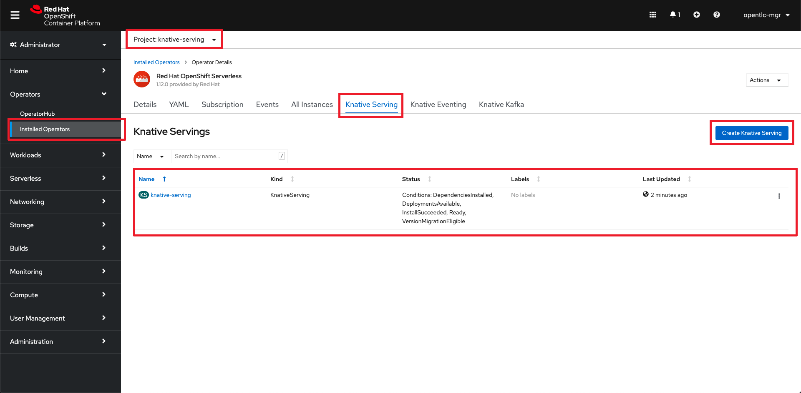

<!DOCTYPE html>
<html lang="en">

<head>
  <meta charset="UTF-8">
  <!--[if IE]><meta http-equiv="X-UA-Compatible" content="IE=edge"><![endif]-->
  <meta name="viewport" content="width=device-width, initial-scale=1.0">
  <meta name="generator" content="Asciidoctor 1.5.4">
  <!-- <title>Quarkus Serverless Datagrid - Deploying Quarkus Serverless apps integrated with
    Datagrid</title> -->
  <link rel="stylesheet" href="https://asciidoclive.com/assets/asciidoctor.js/css/asciidoctor.css">
</head>

<body class="article toc2 toc-left">

<h1>Deploying Quarkus Serverless apps with Datagrid on Red Hat OpenShift Platform</h1>

Table of Contents

<ul class="sectlevel1">
<li><a href="#_background">Background</a></li>
<li><a href="#_prerequisites">Prerequisites</a></li>
<li><a href="#_goals">Goals</a></li>
<li><a href="#_steps">Steps</a></li>
</ul>

<h2 id="_background">Background</h2>

Serverless, a popular word. No need for keeping resources alive where there is no need to. It&rsquo;s event-driven programming, one process per request, and you can scale immediately when you need to. From zero to enough, without you having to worry about it. When it&rsquo;s finished, it scales back to zero, just like that.&rdquo;

What do you need to achieve this? You need something which can offer low memory footprint and fast startup and shutdown times. Can you use Java, sure you can, but can it offer the real benefits required by a serverless application probably not OOTB, it is not natively optimized for running serverless: well &ldquo;When you activate a Java serverless function for the first time, you&rsquo;ll see that it takes about 300 milliseconds to start. This so-called cold-start is relatively fast, but not fast enough, in my opinion. Also, Java is more memory-intensive and when you do cloud-native development, the less memory you consume, the better.&rdquo;

To fix this, many vendors put a lot of effort in optimizing runtimes for containerized environments and cloud-native development. So did Red Hat by launching Quarkus. Quarkus is a Kubernetes-native Java framework, also known as &ldquo;supersonic subatomic Java,&rdquo; that allows developers to build Java applications that are meant to run in, and are optimized for, these type of environments.

This demo will use Quarkus for building the applications, Red Hat OpenShift for Serverless, Red Hat DataGrid for in-memory, distributed, NoSQL datastore solution. The scripts will allow you to create the Red Hat DataGrid cluster and deploy the Quarkus Serverless application on Red Hat OpenShift platform.

<h2 id="_prerequisites">Prerequisites</h2>

<strong>Tools</strong>

The tools you need locally:

<ul>
<li>

Access to Red Hat OpenShift platform

</li>
<li>

JDK, OpenSSL, Keytool

</li>
<li>

oc - OpenShift Command Line Interface (CLI) - Available from&nbsp;OpenShift cluster (See image below)

</li>
<li>

kn - OpenShift Serverless Command Line Interface (CLI)- Available from&nbsp;OpenShift cluster (See image below)

</li>
<li>

Access to command line

</li>
<li>

A browser (Chrome, Firefox)

</li>
</ul>

<strong>OpenShift command line tool download:</strong>

<strong>Skills</strong>

<ul>
<li>

Familiarity with Red Hat OpenShift Platform and Operators.

</li>
<li>

Shell Scripts (optional)

</li>
</ul>

<h2 id="_goals">Goals</h2>

<ul>
<li>

Have Red Hat DataGrid Cluster deployed on Red Hat OpenShift

</li>
<li>

Have the Quarkus Serverless Applications deployed on Red Hat OpenShift

</li>
</ul>

Once the serverless applications are deployed you should be able to hit the URL and see the data appear on the screen in JSON format in the browser.

<h2 id="_steps">Steps</h2>

<ul>
<li>

Provision a Red Hat OpenShift platform

</li>
<li>

Install the OpenShift Serverless Operator (using the UI or CLI)

</li>
</ul>

<ul>
<li>

Install the Knative Serving under Red Hat OpenShift Serverless

</li>
</ul>

<ul>
<li>

Download the scripts to a folder

</li>
<li>

Go to command line and login to your OpenShift installation

</li>
<li>

Edit the <strong>provision-serverless-dg-workshop.sh</strong> (optional)

</li>
</ul>

<ul>
<li>

Execute the <strong>provision-serverless-dg-workshop.sh</strong>

<ul>
<li>

This script will provision the Red Hat DataGrid Cluster and the Quarkus Serverless applications

</li>
<li>

The namespace names are controlled by the following variables in the <strong>provision-serverless-dg-workshop.sh</strong>:

<pre>SERVERLESS_PROJECT_NAME="serverless-apps-1" +
SERVERLESS_PROJECT_DISPLAY_NAME="ServerlessApps"</pre>

<pre>DATAGRID_PROJECT_NAME="datagrid-ws-1" +
DATAGRID_PROJECT_DISPLAY_NAME="DataGridCluster"</pre>

</li>
</ul>

</li>
<li>

Once the provisioning is complete select <strong>Developer</strong> in the dropdown and select <strong>Topology</strong>

</li>
</ul>

<ul>
<li>

Click on the quarkus-serverless-server application and the browser should open and should show an error on the screen (RESTEASY003210: Could not find resource for full path:...) this is expected. Copy the URL and using a <strong>rest client application</strong> execute a post wiht the below URL <strong>http:// &lt;&lt; replace with copied URL of quarkus-serverless-server app&gt;&gt;/employees/</strong> and use the below body in JSON format:

<ul>
<li>

[ { "empId": "1A", "empName": "John Doe", "empProject": "Quarkus" }, { "empId": "2A", "empName": "Jane Doe", "empProject": "Quarkus" }, { "empId": "3A", "empName": "Jo Doe", "empProject": "Quarkus" } ]

</li>
</ul>
<strong>OR</strong>
<ul>
<li>

<strong>curl</strong> -H "Content-Type: application/json" -X POST -d '[ { "empId": "1A", "empName": "John Doe", "empProject": "Quarkus" }, { "empId": "2A", "empName": "Jane Doe", "empProject": "Quarkus" }, { "empId": "3A", "empName": "Jo Doe", "empProject": "Quarkus" } ]' &lt;&gt;/employees

</li>
</ul>

</li>
<li>

Now click on the Open Url icon at the top of the quarkus-serverless-client application.

</li>
<li>

Once you click the browser will open and you should see the list of employees

</li>
</ul>

</body>

</html>
